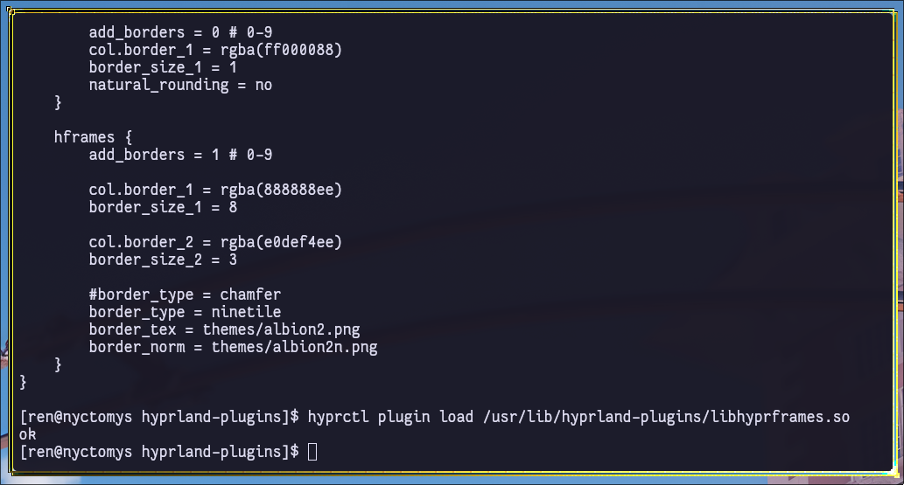

# HyprFrames

<div align = center>



<br>

<div align = left>

Adds some additional border customizations options. When border_type is set to 'chamfer', it functions mostly like borders++; however, the borders corners are chamferred. When border_type is set to 'ninetile', and images are defined, the window borders will be image based. A normal map image corresponding to the texture image will add lighting that follows the mouse position. Use at your own risk. This plugin breaks whenever there is an API update, so disable when updating Hyprland.

Currently this works with:
hyprland-git (v0.47)


## Building:

Ensure hyprland and hyprland-git is installed:
Use `make` or meson/ninja to build.
The compile output should be copied /usr/lib/hyprland-plugins/ to satisfy dependencies.


## Example Config:
```
exec-once = hyprctl plugin load /usr/lib/hyprland-plugins/libhyprframes.so

# remove the default border by setting to 0
general { border_size = 0 }

# chamferred stencil border radius is controlled by decoration config
decoration { rounding = 6 }

plugin {
    hframes {
        add_borders = 2 # 0 - 9

        # you can add up to 9 borders
        col.border_1 = rgba(888888ee)
        col.border_2 = rgba(e0def4ee)

        border_size_1 = 8
        border_size_2 = 3

        # animation needs to be enabled for normal lighting
        # animation = borderangle, 1, 8, default, loop
        
        #border_type = chamfer
        border_type = ninetile 
        border_tex = themes/albion2.png
        border_norm = themes/albion2n.png
    }
}
```

